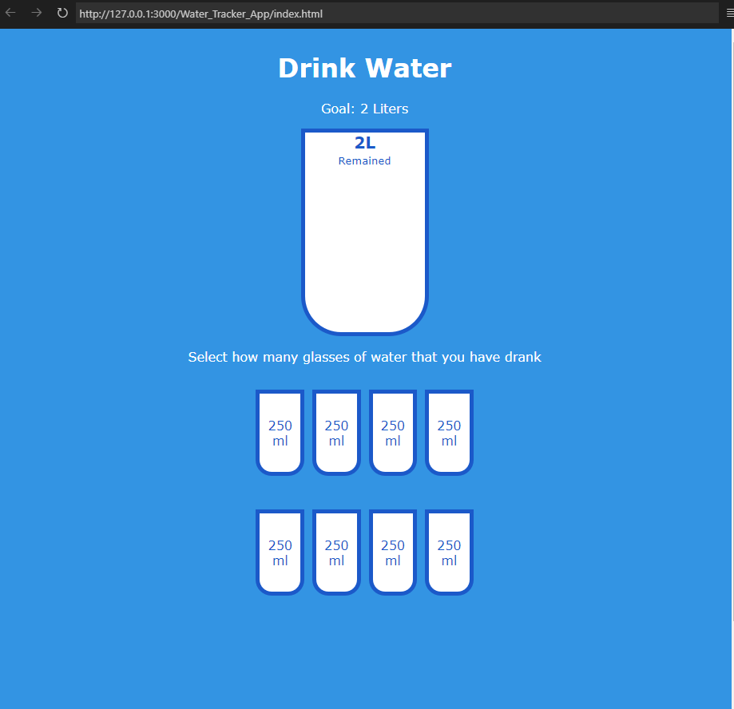

# 💧 Drink Water Tracker

A simple interactive app that helps track your daily water intake. Based on the "50 Projects in 50 Days" challenge.

## 🚀 Features

- Click on small cups to mark water intake (each cup = 250ml)
- Big cup fills with blue as you drink more water
- Shows percentage of water consumed
- Displays how many liters are left to reach the 2L daily goal
- Supports selecting and unselecting cups

## 🛠️ Technologies Used

- HTML
- CSS
- JavaScript (Vanilla)

## 📚 JavaScript Concepts Covered

- DOM selection and manipulation
- Event listeners
- Conditional logic
- `classList.add`, `remove`, `toggle`
- Dynamic style updates (height, visibility)
- Index-based logic and state updates

## 🖼️ Screenshot

_()_!

## 📦 How to Use

1. Clone or download this repo.
2. Open `index.html` in your browser.
3. Click on the cups to track your water consumption.

## ✅ Todo (Optional Enhancements)

- Add localStorage to save progress
- Add animations or sound when goal is reached
- Make the layout responsive for mobile

## 🙌 Acknowledgement

Inspired by [50 Projects in 50 Days](https://50projects50days.com/projects/drink-water/).

---
